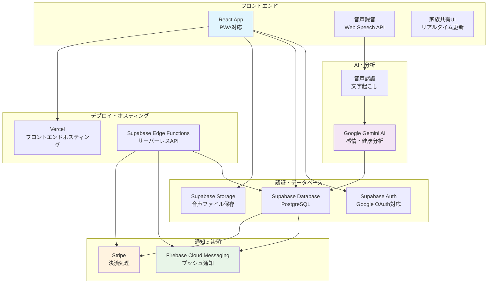

# AI Voice Journal システムアーキテクチャ

## アーキテクチャの特徴

### フロントエンド

- **React + TypeScript**: 型安全な開発
- **PWA 対応**: オフライン利用可能
- **レスポンシブデザイン**: 高齢者に優しい UI

### バックエンド

- **Supabase**: 認証・データベース・ストレージ
- **Edge Functions**: サーバーレス API
- **リアルタイム同期**: 家族間の即座な情報共有

### AI・分析

- **Google Gemini AI**: 感情・健康状態分析
- **Web Speech API**: 音声認識・文字起こし
- **自動分析**: 日記内容の感情スコア算出

### 通知・決済

- **Firebase FCM**: プッシュ通知
- **Stripe**: 安全な決済処理
- **自動課金**: サブスクリプション管理
